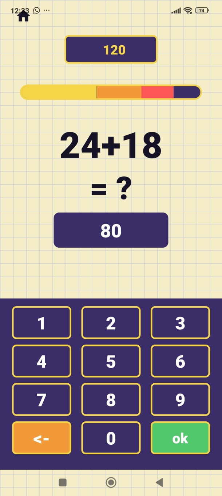

# 🧠 Equations — Mental Math Game

**Equations** is a mobile mental math game built with **React Native and TypeScript**, featuring multiple game modes, progressive difficulty, dynamic equation generation and performance tracking.

<p align="center">
  
  
  
</p>

---

## 🎮 Game Modes

### 🔢 Classic

Solve dynamically generated operations using a custom numeric keypad.

### ✅ True / False

Determine whether a generated equation is correct before time runs out.

### 🔘 Multiple Choice

Choose the correct answer among four dynamically generated options.

### ⏱️ Time Trial

Solve as many operations as possible under continuous time pressure.

<p align="center">
  
  
  
  
</p>

---

## ✨ Features

* 🧮 Dynamic equation generation
* 📈 Three progressive difficulty levels
* ⭐ Performance-based scoring
* ⏱️ Timed gameplay
* ⚙️ Configurable game sessions
* 💾 Local persistence with AsyncStorage
* 📊 Historical statistics by game mode

<p align="center">
  
  
  
</p>

---

## 🏗️ Architecture

Game logic is separated from the UI through reusable hooks and dedicated modules for equation generation, scoring and local persistence.

```text
app/          → Screens & navigation
components/   → Reusable UI
hooks/        → Game logic
lib/math/     → Equation generation
lib/scoring/  → Scoring
lib/storage/  → Local persistence
```

---

## 🛠️ Technologies

**React Native · TypeScript · Expo · Expo Router · AsyncStorage · React Hooks · Animated API**

---

## 📄 Documentation

Detailed functional and technical documentation:

**[View Full Documentation](docs/Functionalities-documentation.pdf)**

---

## 🚀 Run Locally

```bash
git clone https://github.com/Santutuu/Equations-mobile-game.git
cd Equations-mobile-game
npm install
npx expo start
```

