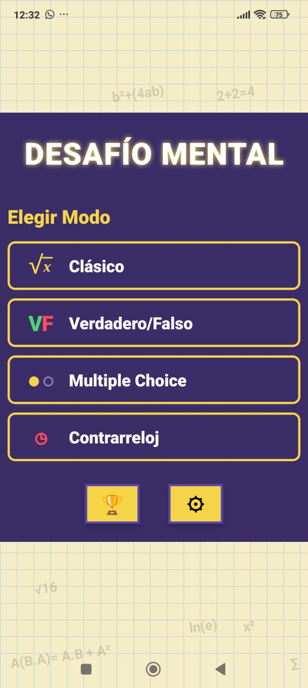
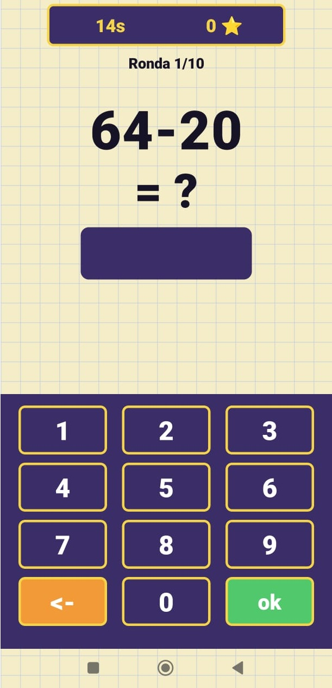
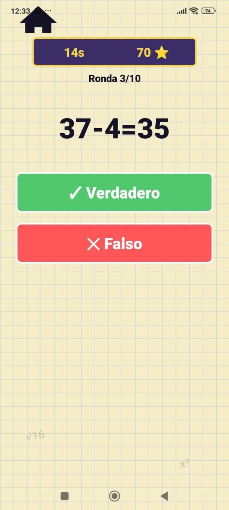
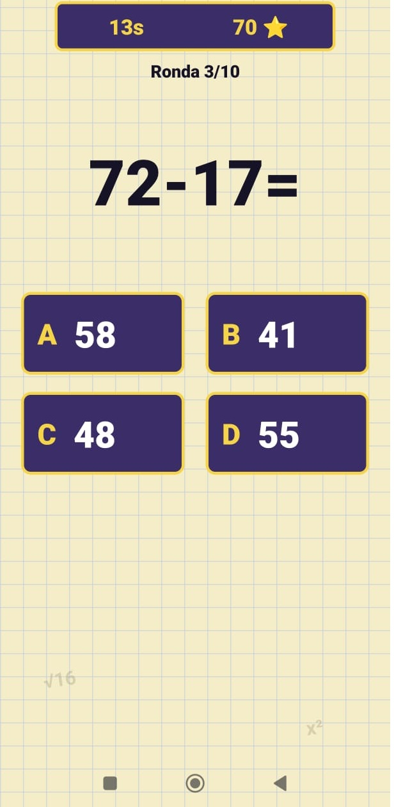
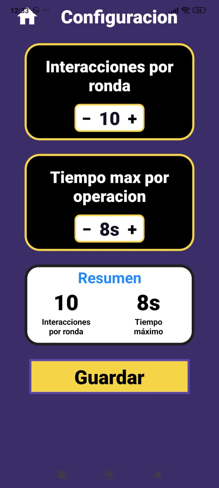
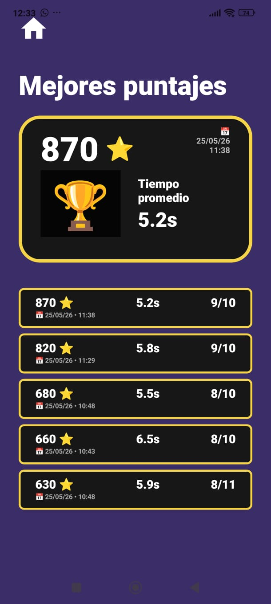

# Equations — Mental Math Game

**Equations** is a mobile mental math game built with **React Native and TypeScript**, featuring multiple game modes, progressive difficulty, dynamic equation generation and performance tracking.

<p align="center">
  
</p>

---

## Game Modes

Four different game modes provide different ways to practice mental arithmetic.

* **Classic:** solve operations using a custom numeric keypad.
* **True / False:** determine whether an equation is correct.
* **Multiple Choice:** choose the correct result among four options.
* **Time Trial:** solve operations under continuous time pressure.

<p align="center">
  
  
  
</p>

---

## Features

* Dynamic equation generation
* 📈 Progressive difficulty with 3 levels
* ⭐ Performance-based scoring
* ⏱️ Timed gameplay
* ⚙️ Configurable game sessions
* 💾 Local persistence with AsyncStorage
* 📊 Historical statistics by game mode

<p align="center">
  
  
</p>

---

## Architecture

The project separates the user interface from the game logic through reusable hooks and dedicated modules.

```text
app/          → Screens & navigation
components/   → Reusable UI components
hooks/        → Game logic
lib/math/     → Dynamic equation generation
lib/scoring/  → Scoring system
lib/storage/  → Local persistence
```

---

## Technologies

<p>
  
  
  
</p>

**React Native · TypeScript · Expo · Expo Router · AsyncStorage · React Hooks · Animated API**

---

## Documentation

A detailed functional and technical description of the project is available here:

**[📘 View Full Project Documentation](docs/Functionalities-documentation.pdf)**

The documentation covers the game architecture, dynamic equation generation, game lifecycle, scoring, difficulty progression, persistence and statistics.

---

## 🚀 Getting Started

Clone the repository:

```bash
git clone https://github.com/Santutuu/Equations-mobile-game.git
```

Install the dependencies:

```bash
cd Equations-mobile-game
npm install
```

Start the application:

```bash
npx expo start
```

Run it using **Expo Go** on a physical device or an Android/iOS emulator.

